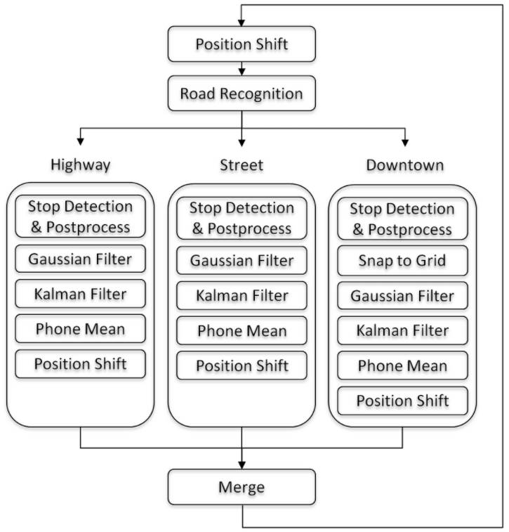

### Google Smartphone Decimeter Challenge 
### Kaggle项目：谷歌手机定位挑战赛

``python gsdc.py`` 
Function: Execute all the postprocesses.
1. Position Shift 
2. Stop Detection and Postprocess 
3. Snap to Grid 
4. Gaussian Filter 
5. Kalman Filter 
6. Phone Mean 
7. Position Shift 

I will complement more details in the following days.
